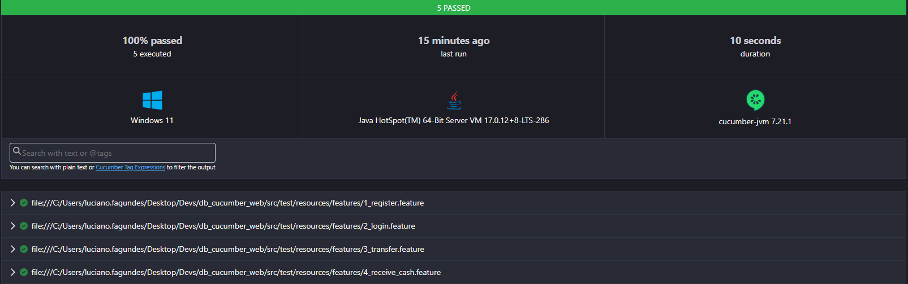

## Desafio Técnico DBServer

### [Bug Bank](https://bugbank.netlify.app/)

>*Um banco com bugs e falhas do seu jeito.*  
>*O Bug Bank foi criado para a prática de testes e automação de testes.*

---  

### Objetivo

Este projeto foi desenvolvido exclusivamente para a [DBServer](https://db.tec.br/) com o objetivo de validar a funcionalidade de transferência entre contas no Bug Bank.

---  

## :clipboard: Passo a passo para realizar uma transferência entre contas

1. ✅ Acesse o site [Bug Bank](https://bugbank.netlify.app/)
2. ✅ Crie duas contas com saldo e anote os dados de acesso.
3. ✅ Acesse uma das contas e realize uma transferência de valor para a outra.
4. ✅ Valide a saída e entrada de valores nas contas envolvidas.

---  

## :hammer_and_wrench: Ferramentas utilizadas


O projeto utiliza **Cucumber**, uma ferramenta de software de código aberto para desenvolvimento de testes automatizados baseados em comportamento (BDD - Behavior-Driven Development).

📖 [Documentação do Cucumber](https://cucumber.io/docs/bdd/)

---  

## :computer: Tecnologias e dependências

### 🔹 Estrutura do projeto:
- [Maven](https://maven.apache.org/download.cgi)
- [Java 17](https://www.oracle.com/java/technologies/javase/jdk17-archive-downloads.html)

### 🔹 Dependências:
- [Selenium Java](https://mvnrepository.com/artifact/org.seleniumhq.selenium/selenium-java/4.29.0)
- [WebDriverManager](https://mvnrepository.com/artifact/io.github.bonigarcia/webdrivermanager/5.9.3)
- [Cucumber Java](https://mvnrepository.com/artifact/io.cucumber/cucumber-java/7.21.1)
- [Cucumber TestNG](https://mvnrepository.com/artifact/io.cucumber/cucumber-testng/7.21.1)
- [Json Simple](https://mvnrepository.com/artifact/com.googlecode.json-simple/json-simple/1.1.1)
- [Java Faker](https://mvnrepository.com/artifact/com.github.javafaker/javafaker/1.0.2)
- [Lombok](https://mvnrepository.com/artifact/org.projectlombok/lombok/1.18.36)

---  

## :arrow_down: Como baixar e executar o projeto

### 🔹 Clonando o repositório
Abra o terminal e execute o comando:
```bash
git clone https://github.com/loopfagundes/db_cucumber_web
```

### 🔹 Executando os testes na IDE
Para executar o projeto na sua máquina local através da IDE:

1. Navegue até:
```
src/test/java/app.netlify.bugbank/TestRunner.class  
```
2. Execute a classe `TestRunner.class`. O navegador **Chrome** será aberto automaticamente.

Caso queira executar os testes em outros navegadores, modifique a configuração em:
```
src/main/java/app.netlify.bugbank/drivers/DriverFactory.class
```
No bloco `Try/Catch`, altere a seguinte linha:
```java  
Driver.valueOf(System.getProperty("driver", "chrome").toUpperCase());  
```
As opções disponíveis são: `chrome`, `firefox` ou `edge` (todas em letras minúsculas).

---  

## 📊 Gerando o relatório de testes

#### Relatórios:

Após a execução, os relatórios de teste podem ser acessados:


1. Navegue até a pasta `report`.

2. Abra o arquivo `report.html`.

3. No IntelliJ IDEA:
    - Clique com o botão direito do mouse, selecione `Open in`, e escolha o navegador desejado.
   
4. No VSCode:
    - Clique com o botão direito do mouse, selecione `Reveal in File Explorer`, e uma janela da pasta será aberta. Clique no arquivo report.html para visualizá-lo.

#### Screenshot:


---  

#### 📊 Como Executar o Pipeline:

1. Acesse de Actions:
    - Entre no repositório db_cucumber_web - [GitHub Actions](https://github.com/loopfagundes/db_cucumber_web/actions)
   

2. Escolha o Workflow:
    - Selecione o workflow desejado na lista disponível.


3. Inicie o Workflow:
    - Caso o workflow permita execução manual, clique em "Re-run all jobs".
    - Certifique-se de selecionar a opção 'build'.


4. Acompanhe os Logs:
    - Clique na execução ativa do workflow para visualizar os logs e monitorar o progresso.

**Observação:**

-  **Outros Workflow**: Os demais fluxos de trabalho são atualizados conforme as implementações, com o objetivo de melhorar a estrutura do código e a qualidade dos testes.

---
Feito com bug, café e muito esforço :beetle::coffee:


